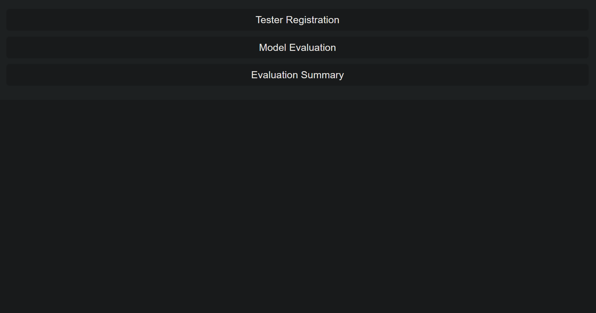
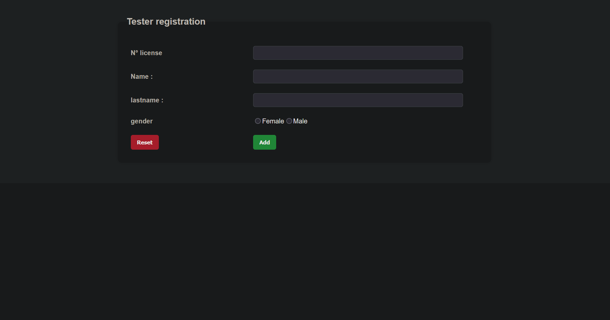
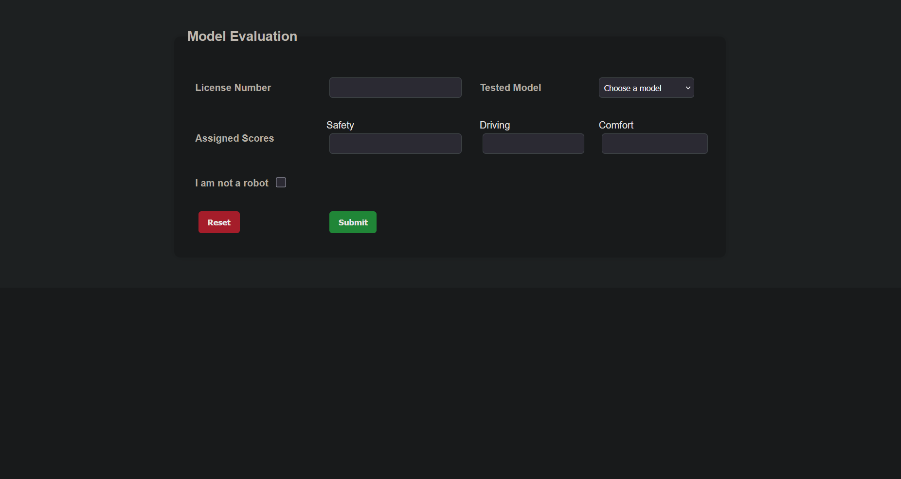

# Car Evaluation System

## Project Description
This is a web-based Car Evaluation System developed using PHP, MySQL, HTML, and CSS.  
The system allows users to submit car evaluations and view results stored in a database.

## Requirements
To run this project, you need to install XAMPP (Apache + MySQL) and use a web browser such as Chrome or Firefox.

## How to Run the Project

1. Install XAMPP from https://www.apachefriends.org/

2. Open the XAMPP Control Panel and start BOTH:
   - Apache
   - MySQL

3. After starting them, click the "Admin" button next to MySQL to open phpMyAdmin in your browser.

4. Copy the project folder named "car-evaluation-system" into the following directory:
   C:\xampp\htdocs\

   (If the folder name is different, for example "car-evaluation-system-main", use that name instead.)

5. Open your browser and go to:
   http://localhost/car-evaluation-system/

6. The main entry file of the project is:
   index.php

## Database Setup (if included)

1. Open phpMyAdmin:
   http://localhost/phpmyadmin

2. Create a database named:
   car_evaluation

3. Import the provided SQL file into the database.

## Important Notes

- You must run the project using XAMPP (localhost).
- Always start Apache and MySQL before running the project.
- Click "Admin" next to MySQL to access phpMyAdmin.
- Do NOT open files directly from your computer (file:///...), always use localhost.
- GitHub does not run PHP code; it only stores the files.

## Features

- Add car evaluations
- Store data in MySQL database
- View evaluation results
- Simple and easy-to-use interface

## Screenshots

### Home Page

### Registration Page

### Model Evaluation Page

### Evaluation Summary Page

## Author

Mohamed Skander Limam
